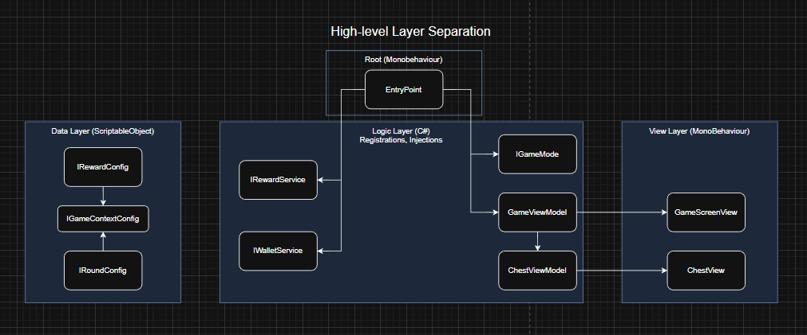

# Treasure Hunt

The project follows a **Reactive MVVM** architecture supported by a **Service Layer** and an **EntryPoint** composition root, ensuring game rules are decoupled from Unity components for enhanced unit testing and modularity. The EntryPoint manages Dependency Injection and service abstractions, instantiating business logic (GameMode) and binding ViewModels to Views. 

Through **Dependency Inversion** and the **Observer pattern**, the Presentation Layer transforms domain logic into reactive states through events, while the View Layer manages visual representation and user input. The system is configuration-driven via ScriptableObjects (making it easily swappable for remote configuration) and optimized with **Object Pooling**. The implementation fulfills the technical requirements by utilizing **UniTask** for asynchronous sequencing and robust cancellation management.

## Key Design Decisions and Trade-offs

I prioritized a **Reactive MVVM** pattern to decouple high-level game logic from Unity’s rendering lifecycle, using UniTask for seamless asynchronous sequences and cancellation safety. A key performance decision was the implementation of a **Hybrid Object Pool** that leverages `InstantiateAsync` to distribute prefab creation over multiple frames, eliminating the frame-rate hitches typically caused by complex UI instantiation and ensuring zero-allocation reuse during round resets. 

**Dependency Inversion** was applied through abstracted services like `IWalletService` and `IRandomService`, facilitating unit testability and the ability to swap local logic for backend-integrated services without modifying core logic. **ScriptableObject-driven configuration** provides a designer-friendly source for game balance, utilizing manual `OnValidate` logic to ensure data integrity for nested serialized structures.

For simplicity within the current scope, I utilized **Direct Prefab Instantiation** over the **Addressables** System and chose to apply certain configuration values (like chest counts) at the start of a round to prioritize state stability. Other trade-offs include using **weak string references** for reward definitions to maintain extensibility, and choosing **struct-based event data** to prevent boxing during UI updates, favoring memory stability over interface-level polymorphism. The decision to expose the `VictoryTargetIndex` through the interface was a deliberate trade-off to simplify the Presentation Layer's reveal logic while maintaining strict business logic encapsulation.

## Instructions to Build and Run
- **Version**: Unity 6 LTS.
- **Dependencies**: UniTask and TextMeshPro packages are required.
- **Configuration**: The balance settings can be found in `Assets/Configs/GameContext.asset`.
- **Setup**: Open the `Game` scene; the `EntryPoint` serves as the composition root.
- **Play**: Press the Play button to initialize the services and start the game.

## Basic initial diagram to build project
